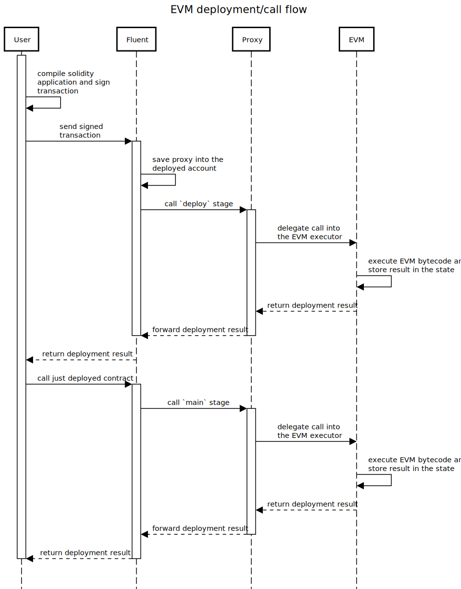

# EVM

Fluent integrates with the EVM by leveraging special EVM precompiled contracts.
These contracts facilitate the execution of EVM bytecode,
enabling the deployment and operation of smart contracts designed for the EVM ecosystem.
This allows developers to seamlessly deploy their applications built for EVM platforms using languages like Solidity or
Viper.

The EVM executor, a Rust-based smart contract, provides two key functions:

1. **`deploy`**: Deploys the EVM application and stores the bytecode state.
2. **`main`**: Executes the already deployed EVM application.

During deployment, a specialized rWasm proxy is deployed under the smart contract address.
This proxy redirects all deployment and execution calls to the EVM executor.

The deployment process is identical to that of Ethereum and other Ethereum-compatible platforms.
Additionally, there are no differences in calling conventions or contract interactions.
This consistency ensures a smooth app migration process for developers.

> **Note:** EVM proxy mode is currently under testing and may be disabled in your environment until testing is complete,
> but it doesn't affect EVM-compatability or developer experience anyhow.
>
> **Note:** There is an AOT compiler that translates EVM into rWasm directly, but it's still under development and
> testing.

The diagram below describes deployment and invocation flow for EVM applications.



```sequence
title EVM deployment/call flow

activate User
User->User: compile solidity\napplication and sign\ntransaction
User->Fluent: send signed\ntransaction
activate Fluent
Fluent->Fluent: save proxy into the\ndeployed account
Fluent->Proxy: call `deploy` stage
activate Proxy
Proxy->EVM: delegate call into\nthe EVM executor
EVM->EVM: execute EVM bytecode and\nstore result in the state
EVM-->Proxy: return deployment result
Proxy-->Fluent: forward deployment result
deactivate Proxy
deactivate Fluent
Fluent-->User: return deployment result

User->Fluent: call just deployed contract
activate Fluent
Fluent->Proxy: call `main` stage
activate Proxy
Proxy->EVM: delegate call into\nthe EVM executor
EVM->EVM: execute EVM bytecode and\nstore result in the state
EVM-->Proxy: return deployment result
Proxy-->Fluent: forward deployment result
deactivate Proxy
Fluent-->User: return deployment result
deactivate Fluent
deactivate User
```