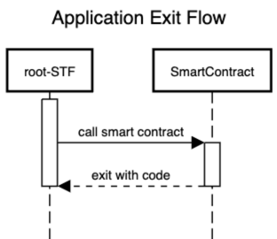
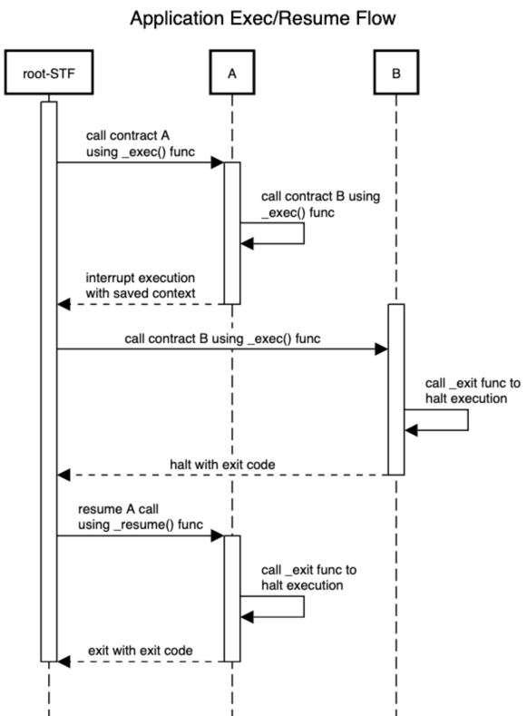
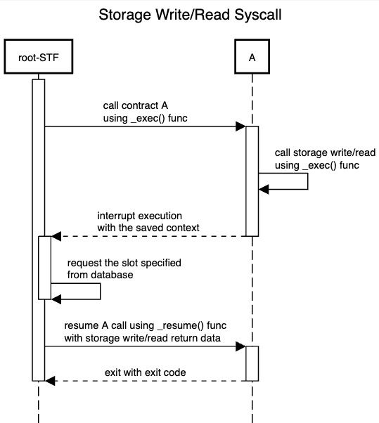

# Interruptions

Fluent interoperability relies heavily on its interruption system.
Smart contracts on Fluent are limited to pure functions,
preventing system calls from accessing external resources such as bytecodes, cold or invalidated storage slots,
or performing nested calls.
Including system calls imposes additional proving overhead,
as proving gadgets must be developed for each call, complicating system development.
This also impacts the flexibility in managing rights or extending contracts,
making the system less sustainable for the fork-less concept.
In such a scenario, system contracts cannot be upgraded without updating the circuits.

Fluent solves this problem by enabling an interruption system that helps manage context switching between nested apps
and the so-called STF that stands for context management.

For simplicity, let's assume that STF, smart contracts and EEs are all functions
(since they are essentially state transition functions or a part of STF).
Functions can be categorized as either root or non-root.
A root function is defined as a function where the depth level is equal to 0.
The root function is pivotal because it handles all context switching and cross-contract accesses,
serving as a security layer.

The root function has the ultimate authority over all state transitions within the blockchain.
Additionally, the root function is in charge of managing and executing system calls.
The root function cannot be interrupted, but it is capable of handling interruptions.

## System Bindings

The system bindings manage context switching in a Fluent interruption system. The following functions are provided:

1. `_exec(..)` - execute bytecode
2. `_resume(..)` - resume interrupted state
3. `_exit(..)` - exit contract

### Application Exit

The application exit binding terminates function execution with the specified exit code. The function is designed to
exit from any smart contract or application. It immediately halts the contract execution and forwards all execution
results, including the exit code and return data, to the caller contract.

```rust
pub fn _exit(code: i32) -> !;
```

**Constraints:**
The exit code must always be a negative 32-bit integer.
Supplying a positive exit code will result in a `NonNegativeExitCode` execution error.
Positive exit codes indicate interrupted execution and are exclusive to the `_exec` or `_resume` functions.



```sequence
title Application Exit Flow

activate root-STF
root-STF->SmartContract:call smart contract
activate SmartContract
SmartContract-->root-STF:exit with code
deactivate SmartContract
deactivate root-STF
```

### Execute Bytecode or Send Interruption

This binding executes a nested call with the specified bytecode poseidon hash, or sends an interruption to the parent
execution call though context switching. If the depth level is greater than 0 then an interruption occurs, otherwise,
bytecode is executed.

**Parameters**:

- `hash32_ptr`: A pointer to a 254-bit poseidon hash of a contract to be called.
- `input_ptr`: A pointer to the input data (const u8).
- `input_len`: The length of the input data (u32).
- `fuel_ptr`: A mutable pointer to a fuel value (u64). The consumed fuel is stored in the same pointer after execution.
- `state`: A state value (u32), used internally to maintain function state.

**Returns**:

- An `i32` value indicating the result of the execution. A negative or zero result stands for terminated execution,
  while a positive code stands for interrupted execution (works only for root execution level).

```rust
pub fn _exec(
    hash32_ptr: *const u8,
    input_ptr: *const u8,
    input_len: u32,
    fuel_ptr: *mut u64,
    state: u32,
) -> i32;
```



```sequence
title Application Exec/Resume Flow

activate root-STF
root-STF->A:call contract A\nusing _exec() func
activate A
A->A:call contract B using\n_exec() func
A-->root-STF:interrupt execution\nwith saved context
deactivate A
activate B
root-STF->B: call contract B using _exec() func
B->B: call _exit func to\nhalt execution
B-->root-STF: halt with exit code
deactivate B
root-STF->A: resume A call\nusing _resume() func
activate A
A->A: call _exit func to\nhalt execution
A-->root-STF: exit with exit code
deactivate A
deactivate root-STF
```

#### Resume Execution

Resumes the execution of a previously suspended function call.

**Parameters**:

- `call_id`: A unique identifier for the call that needs to be resumed.
- `return_data_ptr`: A pointer to the return data that needs to be passed back to the resuming function. This should
  point to a byte array.
- `return_data_len`: The length of the return data in bytes.
- `exit_code`: An integer code that represents the exit status of the resuming function. Typically, this might be 0 for
  success or an error code for failure.
- `fuel_ptr`: A mutable pointer to a 64-bit unsigned integer representing the fuel needed to be charged. The consumed
  fuel result is also stored in the same pointer.

**Returns**:

- An `i32` value indicating the result of the resumption.

```rust
pub fn _resume(
    call_id: u32,
    return_data_ptr: *const u8,
    return_data_len: u32,
    exit_code: i32,
    fuel_ptr: *mut u64,
) -> i32;
```

The `resume` function operates similarly to `exec`,
but it requires an interrupted call ID and the interruption result (including return data and exit code).
Interruption events may also occur during the resume process,
requiring an execution loop capable of handling and correctly processing these interruptions.

## System Calls

System calls use the same approach as an interruption system.
Since root-STF function is responsible for all state transitions,
including cold/warm storage reads,
then a syscall can be represented as an interruption to the ephemeral smart contract.

For accessing state data, Fluent uses special ephemeral smart contracts to access information located outside a smart
contract. For example, in case of storage cache invalidation, the contract must request the newest info from the root
call instead of reading invalidated cache. Also, nested calls to other contracts require ACL checks that must be checked
and verified by the root-STF.

Here is an example of what the system call looks like for Rust contracts.

```rust
fn syscall_storage_read<SDK: NativeAPI>(native_sdk: &mut SDK, slot: &U256) -> U256 {
  // do a call to the root-STF to request some storage slot
  let (_, exit_code) = native_sdk.exec(
      &SYSCALL_ID_STORAGE_READ, // an unique storage read code hash
      slot.as_le_slice(), // a requesting slice with data (aka call-input)
      GAS_LIMIT_SYSCALL_STORAGE_READ, // a gas limit for this call (max threshold)
      STATE_MAIN, // state of the call (must always be 0, except some special tricky cases)
  );
  // make sure returning result is zero (Ok)
  assert_eq!(exit_code, 0);
  // read output from the return data (storage slot value is always 32 bytes)
  let mut output: [u8; 32] = [0u8; 32];
  native_sdk.read_output(&mut output, 0);
  // convert return data to the U256 value
  U256::from_le_bytes(output)
}
```

> For example, if smart contract **A** needs to send a message to smart contract **B**,
> it can trigger a special system call interruption.
> Upon interruption, the root-STF (State Transition Function) processes the interruption,
> performs ACL (Access Control List) checks,
> executes the target application, and then resumes the previous context with the appropriate exit code and return data.



```sequence
title Storage Write/Read Syscall

activate root-STF
root-STF->A:call contract A\nusing _exec() func
activate A
A->A:call storage write/read\nusing _exec() func
A-->root-STF:interrupt execution\nwith the saved context
deactivate A
activate root-STF
root-STF->root-STF: request the slot specified\nfrom database
root-STF->A: resume A call using _resume() func\nwith storage write/read return data
deactivate root-STF
activate A
A-->root-STF: exit with exit code
deactivate A
deactivate root-STF
```