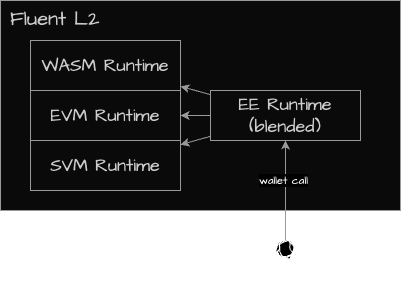

# Blended EE

Blended EEs within Fluent operating as execution proxies.
Since Fluent only supports rWasm bytecode, then every operation inside Fluent must be represented using rWasm ISA.

   
    
   <i>Architecture design of Blended EE</i>

There are two main options for this approach:

1. **Emulation**: Utilizing an embedded VM that operates as a Wasm-based smart contract. This method simplifies the process for developers, who can easily compile their VMs into rWASM. However, the overhead from emulation can occasionally lead to significant performance issues.

2. **Simulation**: Employing an AOT compiler to convert the original bytecode into rWASM bytecode. This approach requires developers to support compilation from their IR to rWasm, which is a time-intensive process demanding rigorous testing. Despite the increased complexity in the deployment process, which involves running the entire compiler, the execution performance can be significantly enhanced.

For example, Fluent presently incorporates the EVM using the proxy contract method.
A proxy with a delegate call forwards execution to a unique EVM loader smart contract.
This setup eliminates the need for address mapping or transaction verification.
ABI encoding/decoding format can be used, and contracts can be managed using default EVM-compatible data structures,
such as storage, block/transaction structures.

> *Note: AOT compiler for EVM to rWasm is currently a work in progress and will eventually replace the existing proxy model.*

Advantages:
- **Native Interoperability**: Different EEs deployed with this approach coexist within the same state space and can natively interoperate with one another. Since they share the same address space, isolation isn't required.
- **Efficiency**: Enables the inclusion of new VMs or EEs without stringent integration standards, enhancing overall efficiency.

Disadvantages
- **Limitations**: Not all EEs can be integrated within this model due to inherent limitations and potential standard violations. This might necessitate the development of an additional migration toolkit, requiring developers to recompile or slightly modify applications deployed using the Isolated EE Simulation model.

For instance, CosmWasm can be integrated using both approaches.
In an Isolated EE, the original address format can be maintained,
while in a Fully Blended EE, native composability with other EEs on Fluent is achievable.

## Composability

To achieve native composability on Fluent, an EE must coexist within the same trie space as the default EVM+Wasm EEs.
It should adhere to established EVM standards, including address formatting and derivation strategies
(for example, CREATE/CREATE2 for smart contract deployment).
The EE must not execute arbitrary account or state modifications,
and can only manage basic Ethereum-compatible accounts.

As a result, apps built with the proxy model can natively interoperate with other native-compatible EEs.
Since they share the same address space, isolation isn't required.
Consequently, Wasm apps can directly interact with EVM apps and vice versa.