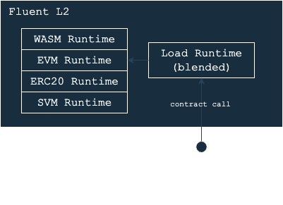

# Composability

Blended EEs within Fluent operating as execution proxies.
Since Fluent only supports rWasm bytecode, then every operation inside Fluent must be represented using rWasm ISA.

   
    
   <i>Architecture design of Blended EE</i>

There are two main options for this approach:

1. **Translation**: A translation from one binary format into rWasm. This concept is used for Wasm application deployment where runtime is a Wasm → rWasm compiler.

2. **Runtime**: An precompiled execution runtime developed using Wasm and compiled into machine code. This concept is used by EVM, SVM, ERC20 runtimes.

For example, Fluent presently incorporates the EVM/SVM using the account ownership method (aka runtime proxy).
A proxy with a delegate call forwards execution to a unique EVM/SVM loader smart contract.
This setup eliminates the need for address mapping or transaction verification.
ABI encoding/decoding format can be used, and contracts can be managed using default EVM/SVM-compatible data structures,
such as storage, block/transaction structures.

To achieve native composability on Fluent, an EE must coexist within the same trie space as the default EVM+Wasm EEs.
It should adhere to established EVM standards, including address formatting and derivation strategies
(for example, CREATE/CREATE2 for smart contract deployment).
The EE must not execute arbitrary account or state modifications 
and can only manage basic Ethereum-compatible accounts.

As a result, apps built with the proxy model can natively interoperate with other native-compatible EEs.
Since they share the same address space, isolation isn't required.
Consequently, Wasm apps can directly interact with EVM apps and vice versa.

## State Access

Fluent operates with state tries through a pure functional approach,
where every smart contract and root-STF can be represented as a function.
In this model, the input provides a list of dependencies,
and the output yields an execution result along with a number of logs.

However, this isn't entirely feasible due to cold storage reads and external storage dependencies,
such as CODEHASH-like EVM opcodes.
To address this, Fluent employs an interruption system to "request" missing information from the root-STF.
This is particularly useful for operations involving cold storage or invalidated warm storage.