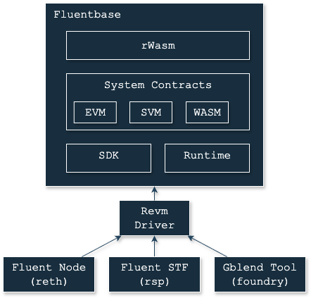

# Architecture

Fluent is an Ethereum Layer L2 rollup designed to natively execute EVM, SVM and Wasm-based programs.
Fluent exists as a unified state machine,
where all contracts can call each other, regardless of which VM they were originally built for.

As a rollup, Fluent supports scalable and efficient execution by committing state changes to Ethereum L1.
This process involves compressing the state changes using ZK proofs, specifically SNARKs.

   
    
   <i>The base architecture of Fluent</i>

The Fluent operates on a modified version of [Reth](https://github.com/fluentlabs-xyz/fluent),
using its own execution engine that replaces [Revm](https://github.com/fluentlabs-xyz/revm-rwasm).
It maintains backward compatibility with most existing Ethereum standards, such as transaction and block structures.
However, Fluent is not confined to Reth exclusively, as it features an independent execution runtime.

Furthermore,
Fluent enables a fork-less runtime upgrade model
by incorporating the most critical and upgradable runtime execution codebase within the genesis state.
The only persistent element within the runtime is the transaction format.

Additionally, Fluent is always post-Prague compatible and does not support any EIPs implemented before the Prague fork.
Maintaining backward compatibility with all previous forks is unnecessary.
The EVM runtime can be upgraded to retain compatibility with EVM.